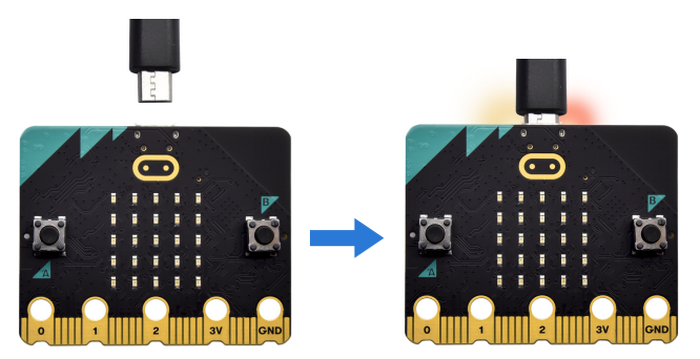
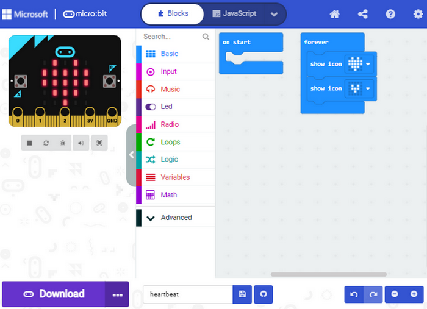
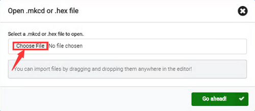

## Micro:bit Board Introduction

### 1. What is Micro:bit?

#### 1.1 Micro:bit V2 Main Board Layout

---

#### 1.2 micro:bit V2 Main Board Pin-out

Micro:bit pin functions:

| Function             | Pin                                                          |
| -------------------- | ------------------------------------------------------------ |
| GPIO                 | P0, P1, P2, P3, P4, P5, P6, P7, P8, P9, P10, P11, P12, P13, P14, P15, P16, P19, P20 |
| ADC/DAC              | P0, P1, P2, P3, P4, P10                                      |
| IIC                  | P19 (SCL), P20 (SDA)                                         |
| SPI                  | P13 (SCK), P14 (MISO), P15 (MOSI)                            |
| PWM(commonly used)   | P0, P1, P2, P3, P4, P10                                      |
| PWM(uncommonly used) | P5, P6, P7, P8, P9, P11, P12, P13, P14, P15, P16, P19, P20   |
| occupied             | P3(LED Col3), P4(LED Col1), P5(Button A), P6(LED Col4), P7(LED Col2), P10(LED Col5), P11(Button B) |

Visit the official website for more details:

[microbit hardware](https://tech.microbit.org/hardware/edgeconnector/)

[https://microbit.org/guide/hardware/pins/](https://microbit.org/guide/hardware/pins/)

---

#### 1.3 Notes for the Application of Micro:bit V2 Board

1. It is recommended to cover it with a silicone protector to prevent short circuit for it has a lot of sophisticated electronic components

2. Its IO port is very weak in driving since it can merely handle current less than 300mA. Therefore, do not connect it with devices operating in large current, such as servo MG995 and DC motor or it will get burnt. Furthermore, you must figure out the current requirements of the devices before you use them and it is generally recommended to use the board together with a Micro:bit shield.

3. It is recommended to power the main board via the USB interface or via the battery of 3V. The IO port of this board is 3V, so it does not support sensors of 5V. If you need to connect sensors of 5 V, a Micro: Bit expansion board is required.

4. When using pins(P3, P4, P6, P7, P10) shared with the LED dot matrix, blocking them from the matrix or the LEDs may display randomly and the data about sensors connected maybe wrong.

5. No use of P19 and P20 IO ports! Pin 19 and 20 can not be used as IO ports though the Makecode shows they can. They can only be used as I2C communication.

6. The battery port of 3V cannot be connected with battery more than 3.3V or the main board will be damaged.

7. Forbid to operate it on metal products to avoid short circuit.

To put it simple, Micro:bit V2 main board is like a microcomputer which has made programming at our fingertips and enhanced digital innovation. And as for programming environment, BBC provides a website: [https://microbit.org/code/](https://microbit.org/code/), which has a graphical MakeCode program easy for use.

---

### 2. Micro:bit Driver Installation

**Micro:bit is free of driver installation. However, in case your computer fail to recognize the main board, you can install the diver too.**

Driver installation: 

Connect micro:bit mainboard to computer via USB cable.

Find the driver file in **Resources** folder and click it to **Install**.

Click **Install**.

Click “Install” and “Finish”.

Click “Computer” —> “Properties” —> “Device manager”:

---

### 3. Programming

The following instructions are applied for Windows system but can also serve as a reference if you are a different-system-user.

#### 3.1 Quick Start

This chapter describes how to write program and load the program to the Micro: Bit main board. Visit official website for more details: [https://microbit.org/guide/quick/](https://microbit.org/guide/quick/)

##### Step1 Connect to Micro:bit

Connect the board to computer via USB cable. 

For how to program via mobile deceives: https://microbit.org/get-started/user-guide/mobile/

Multiple operation systems are compatible with this board, including Macs, PCs, Chromebooks and Linux (Raspberry Pi).

If the red LED on the back of the board is on, that means the board is powered. When your computer communicates with the main board via the USB cable, the yellow LED on it will flashes. For example, it will flash when you burn a “hex” file.

Then Micro: bit main board will appear on your computer as a driver named “MICROBIT(E:)”. Please note that it is not an ordinary USB disk as shown below.

##### Step2 Write programs

Online version of Makecode: [https://makecode.microbit.org/](https://makecode.microbit.org/)

Click New Project; The dialog box Create a Project appears, fill it with “heartbeat” and click “Create  √” to edit. If you are Windows 10 system, it is also viable to edit on the APP MakeCode for micro:bit , which is exactly like editing in the website. 

Windows 10 App download: [https://www.microsoft.com/](https://www.microsoft.com/zh-cn/p/makecode-for-micro-bit/9pjc7sv48lcx?ocid=badgep&rtc=1&activetab=pivot:overviewtab)

Here we demonstrate on Google Chrome.

Write a micro:bit code. 

Drag some Blocks to the editing area and then run your program in Simulator as shown below. We demonstrate how to edit heartbeat program. 

Click “ JS JavaScript” to check JavaScript language.

Click the arrow to switch to “Python” language.

##### Step3 Download code

If your computer is Windows 10 and you have downloaded the APP MakeCode, what you will only have to do is to download the program to your Micro: Bit board.

If you are writing program on a browser, follow these steps: 

Click the “Download” in the editor to download a "hex" file, which is a compact program format for Micro: Bit to read. Copy the "hex" file to your board. For Windows, you can also click and select “Send to → MICROBIT” to copy the hex file to the Micro: Bit board.

Or, you may directly drag the “hex” file in MICROBIT.

During the process of copying the hex file to the Micro: bit, the yellow LED on the back of the board flashes. When the duplication is completed, the LED will stop flashing and remain on.

##### Step4 Run programs

After the program is uploaded to the Micro: bit, you can power it via USB cable or an external power. Then the 5 x 5 LED matrix displays a heartbeat pattern.

Power via USB: 

Power via external 3V: 

**Caution**: 

When you programs each time, the driver of MICROBIT will automatically eject and return so hex files will disappear. The board only has access to hex files rather than save them!

##### Step5 Master it

This chapter has described how to use the Micro:bit main board.  Except for the Makecode graphical programming, if you want to write Micro:bit programs in other languages, visit https://microbit.org/code/ to learn more, or visit https://microbit.org/projects/ to find something you want to have a go.

#### 3.2 Makecode

Open [Google Chrome online version](https://makecode.microbit.org/), or open the Windows 10 App makecode.

Click “New Project” and enter “heartbeat” to edit the code. Click “Create √” the main interface of Makecode. 

There are blocks “on start” and “forever” in the code editing area. When the power is plugged or reset, “on start” means that the code in the block only executes once, while “forever” implies that the code runs cyclically.

#### 3.3 Quick Download

As mentioned before, if your computer is Windows 10 and you have downloaded the APP MakeCode. you can quickly download codes to the Micro: Bit main board by clicking “Download”.

While it is a little more trickier if you are using a browser to enter Makecode. However, if you adopt Google Chrome that is suitable for Android, ChromeOS, Linux, macOS and Windows 10, the process can be easier, too.

Herein, we use the webUSB of Chrome to access the hardware device connected by USB. You could refer to the following steps to connect and pair devices. And then we download codes in our computer.

Devices Pairing:

Connect the board to computer via micro USB cable. 

Click “...” and “Connect device”.

“Next”.

“Next”.

Then select the corresponding device and click “Connect”. If no device shows up for selection, please refer to: https://makecode.microbit.org/device/usb/webusb/troubleshoot

For how to update micro:bit firmware: https://microbit.org/guide/firmware/

Click “Done”. 

Download program:

After connection, click , and when it changes into , you successfully download it.

#### 3.4 Makecode Extension Library

##### 3.4.1 Add library

Open makecode to enter a certain project, click the gear-shaped icon(settings) in the upper right corner to choose “Extensions”.

Or click Advanced to add Extensions.

Search the library you want. 

For instance, a servo library is required, so you can search "servo" to add one.

Back to the interface and you can see a Servos library.

##### 3.4.2 Update/Delete library

Click “JavaScript” to switch to text code.

Click “Explorer”. 

Find the library you want to remove and click the trash can icon to delete it.

“Remove it”.

Click “Blocks” to return to graphical programming.

And the block is removed.

#### 3.5 Resources and Test Code

Click to download the code files: **缺链接**

##### 3.5.1 Import code

We provide hexadecimal code files (project files) for each project. The file contains all the contents of the project and can be imported directly, or you can manually build the code blocks (in this way, extensions are required to be installed). 

**For simple projects, dragging a block of code to complete the program is recommended.**

**For complex ones, it is recommended to conduct the program by loading the hex code files.**

Let's take the "Heartbeat" project as an example to show how to load the code. 

Open the Web version of Makecode or the Windows 10 App Makecode, and click “Import”.

Click “Import File...”.

Choose “Heart beat.hex”.

In addition to the above method, you can also drag the the test code into the code editing area, as shown below:

Wait for loading.

If you are a Windows7/8 user, Google Chrome is not able to read digital/analog signals of modules, so we need a tool named CoolTerm to read them. Below is the download method of this software. 

##### 3.5.2 Install CoolTerm

CoolTerm software is a nice choice to read the serial data. How to download: [https://freeware.the-meiers.org/](https://freeware.the-meiers.org/)

1. We take PC Windows as an example to download and unzip CoolTerm Win, and Mac/Linux can take it as a reference. Choose CoolTerm Win to download and unzip.

2. Make sure the driver is connect to computer. Click to execute the software.

3. The functions of each button on the Toolbar:

| Icon                    | Function                                        |
| ----------------------- | ----------------------------------------------- |
|  | Open a new Terminal                             |
|  | Open a saved Connection                         |
|  | Save the current Connection to disk             |
|  | Open the Serial Connection                      |
|  | Close the Serial Connection                     |
|  | Clear the Received Data                         |
|  | Open the Connection Options Dialog              |
|  | Display the Terminal Data in Hexadecimal Format |
|  | Display the Help Window                         |

