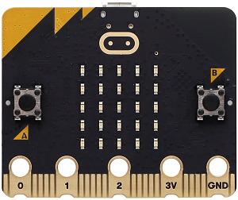
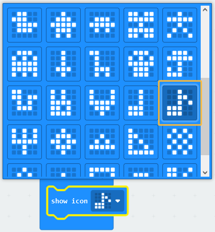
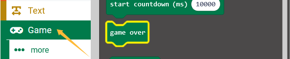
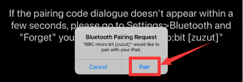
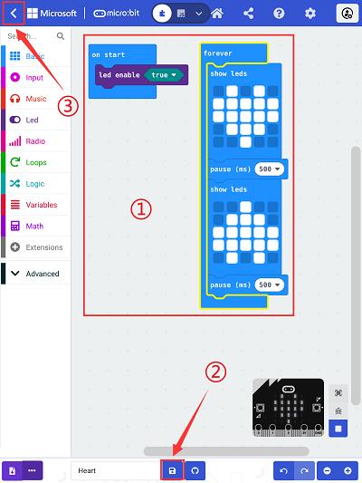

## Micro:bit Basic Projects

### Code Download

[DOWNLOAD](./Code.zip)

Download and unzip these files. Here all codes are in folder **Code**.

For convenience, we move the codes into: **D:\Code\1.Code_kidsuno**. You can also choose to move it into any disks at will. 

### Project 1: Heartbeat

#### Introduction

This project is easy to conduct with a micro:bit main board, a Micro USB cable and a computer. The micro:bit LED dot matrix will display a beating heart. It serves as a start for your entry to the programming world!

#### Components

| Name                  | Picture                           |
| --------------------- | --------------------------------- |
| Micro:bit mainboard*1 |  |
| Micro USB cable*1     |                |

#### Connection

Connect the board to your computer via micro USB cable.

#### Test Code

Find code blocks:

① Choose an icon to show on the LED matrix.

Build code blocks:

Click “JSJavaScript” to see Java code:

Pull down to click “Python” to see Python code:

#### Test Result

For Windows 10 App, just click download. For browser, send the "hex" file to the micro:bit board.

After uploading test code to micro:bit main board and keeping the connection with the computer to power the main board. 

The micro:bit on-board LED matrix circularly shows  and .

If the downloading is not smooth, please remove the USB cable from the main board and then reconnect them and reopen Makecode to try again.

### Project 2: Single LED Blinking

#### Introduction

In this project, we intend to control a certain LED on the micro:bit board to light up.

#### Components

| Name                  | Picture                           |
| --------------------- | --------------------------------- |
| Micro:bit mainboard*1 |  |
| Micro USB cable*1     |                |

#### Connection

Connect the board to your computer via micro USB cable.

#### Principle

The LED dot matrix consists of 25 LEDs arranged in a 5 by 5 square, corresponding to axis-X and Y. In order to locate these LEDs quickly, we can regarded this matrix as a coordinate system by marking 0~4 from top to bottom and from left to right.

Therefore, the LED sat in the second of the first line is (1,0) and the LED positioned in the first of the third row is (2,0), the fifth of the first column is (0,4), the second of the third column is (2,1), and others likewise.

#### Test Code

Find code blocks:

① plot a coordinate to light up this LED.

② unplot the coordinate to turn off this LED. 

③ toggle the state of a certain LED by a coordinate: if it is now on(off), turn it off(on). 

④ turn on/off the LED matrix.

⑤ a pause of the program, whose unit is microseconds. It can be used to slow down the execution speed of the program.

Build code blocks:

#### Test Result

For Windows 10 App, just click download. For browser, send the "hex" file to the micro:bit board.

After uploading test code to micro:bit main board and keeping the connection with the computer to power the main board. 

The LED at (1,0) blinks for 1s and then LED at (3,4) blinks for also 1s. These actions repeat.

### Project 3: LED Dot Matrix

#### Introduction

Dot matrices are very commonplace in daily life. They have found wide applications in LED advertisement screens, elevator floor display, bus stop announcement and so on.

The LED dot matrix of Micro: Bit main board contains 25 LEDs in a grid. Previously, we have succeeded in controlling a certain LED to light by integrating its position value into the test code. Theoretically, we can turn on many LEDs at the same time to show patterns, digits and characters. 

#### Components

| Name                  | Picture                           |
| --------------------- | --------------------------------- |
| Micro:bit mainboard*1 |  |
| Micro USB cable*1     |                |

#### Connection

Connect the board to your computer via micro USB cable.

#### Test Code

Find code blocks:

① show a number on LED matrix. If it is a number more than one bit, it displays content that scroll into view.

② show icons on the LED matrix.

③ choose an icon to show on the LED matrix.

④ show string on the LED matrix. If the string is too long, it displays content that scroll into view.

⑤ turn all LED on the matrix.

⑥ a pause of the program, whose unit is microseconds. It can be used to slow down the execution speed of the program.

⑦show arrows on the LED matrix.

Build code blocks:

#### Test Result

For Windows 10 App, just click download. For browser, send the "hex" file to the micro:bit board.

After uploading test code to micro:bit main board and keeping the connection with the computer to power the main board. 

Numbers 1, 2, 3, 4, 5 on the 5×5 LED matrix, and icons repeatedly show on it, including: 

“down” arrow ;

string “Hello!”;

“heart” icon ;

“northeast” arrow ; 

“southeast” arrow ; 

“southwest” arrow ; 

“northwest” arrow .

### Project 4: Programmable Buttons

#### Introduction

Buttons can be used to control circuits. In an integrated circuit with a button, the circuit is connected when the button is pressed and if you release the button, the circuit is open.

Micro: Bit main board boasts three buttons: two programmable buttons (marked with A and B), and a reset button at back. By pressing the two programmable buttons, three different signals can be input. We can press button A or B or both so that the LED dot matrix shows A, B and AB respectively. 

#### Components

| Name                  | Picture                           |
| --------------------- | --------------------------------- |
| Micro:bit mainboard*1 |  |
| Micro USB cable*1     |                |

#### Connection

Connect the board to your computer via micro USB cable.

#### Test Code 1

Find code blocks:

① enable a program (when something happens, for instance, when a button is pressed). When button A or/and B is pressed, run the program.

When you enable this function in browser, please click the buttons on your screen rather than on the micro:bit board.

- button A or B: press and release whtin 1s to enable the function.
- button A and B: press A and B, release one of them within 1.5s after the second button is pressed to enable the function.

② show string on the LED matrix. If the string is too long, it displays content that scroll into view.

Build code blocks:

#### Test Result 1

For Windows 10 App, just click download. For browser, send the "hex" file to the micro:bit board.

After uploading test code to micro:bit main board and keeping the connection with the computer to power the main board. 

Press button A and release, the 5×5 LED matrix shows “A”; press button B and release, it shows “B”. Press button A and B at the same time and then release, the matrix shows “AB”.

#### Test Code 2

Find code blocks:

① enable a program (when something happens, for instance, when a button is pressed). When button A or/and B is pressed, run the program.

When you enable this function in browser, please click the buttons on your screen rather than on the micro:bit board.

- button A or B: press and release whtin 1s to enable the function.
- button A and B: press A and B, release one of them within 1.5s after the second button is pressed to enable the function.

② create a variable.

③ enable an equal sign to assign a number or string to the variable.

When enable an equal sign to make an assignment, this sign is also called assignment operator, and the content is called a value.

**e.g.** assign number: 

This block assigns 5 to variable item and then it will show on the LED matrix.

**e.g.** assign string: 

This block set variable name to Joe and then it will show on the LED matrix.

**NOTE**: The assignment operator are available to ang types of variables, including numbers and strings.

④ add the value of the variable by a certain value.

With this block, the variable will add by a certain value as you set. This is called addition assignment.

⑤ a variable.

 ⑥ turn on/off  the LED matrix.

⑦ show a bar graph of the value.

Bar graph displays numbers as lines of varying lengths. The value is plotted on the LED matrix as the ratio of the value to the height value of the set maximum range. Therefore, if there are 25 LEDs on the matrix, number 9 with a height value of 50 will display about 5 LEDs on the matrix.

⑧ the condition can be true or false to determine whether to run the code.

Code blocks in “if” only run **when the condition is true**. A true condition can be obtained from the comparation of a variable to a value or to a variable.

⑨ comparison operator, comparing whether the left and right are equal, and the result of the comparison is Boolean true or false. 

Build code blocks:

#### Test Result 2

For Windows 10 App, just click download. For browser, send the "hex" file to the micro:bit board.

After uploading test code to micro:bit main board and keeping the connection with the computer to power the main board. 

Press the button A to increase the bar height, and the lighting LEDs on the matrix rise. Press the button B to decrease the bar height, and the lighting LEDs on the matrix descend.

### Project 5: Temperature Detection

#### Introduction

The micro:bit main board is actually not equipped with a temperature sensor, but uses nNFR52833 chip for temperature detection. Therefore, the detected value is much closer to the temperature of the processor, so there maybe deviation from the ambient value. 

Its detection range is -40 ~ 105℃.

#### Components

| Name                  | Picture                           |
| --------------------- | --------------------------------- |
| Micro:bit mainboard*1 |  |
| Micro USB cable*1     |                |

#### Connection

Connect the board to your computer via micro USB cable.

#### Test Code1

Find code blocks:

① write **Name: value** and a line-break(\r\n) on the serial monitor in pair.

It is common to use Name value pairs when reporting or recording data. They are displayed together as a text output string in the form of Name and value. The Name and value are separated in the string by a colon”:”. A Name value pair that reports a temperature of -15 degrees looks like:

Temperature: -15

② set the USB used to serial input and output.

③ ambient temperature. Temperature is measured in degrees Celsius (metric). The micro:bit can find ambient temperatures by the temperature of its computer chip. 

④ a pause of the program, whose unit is microseconds. It can be used to slow down the execution speed of the program.

Build code blocks:

#### Test Result1

For Windows 10 App, just click download. For browser, send the "hex" file to the micro:bit board.

After uploading test code to micro:bit main board and keeping the connection with the computer to power the main board. 

Click “Show console Device".

Display the serial output data, press the nNRF52833 processor of the micro:bit board and the temperature begins to rise slowly after a period of time, as shown below:

If you're running Windows 7 or 8 instead of Windows 10, Google Chrome won't be able to match devices. so you'll need CoolTerm. 

Open CoolTerm and click **Options** to select **SerialPort**, set COM port and put baud rate to 115200 (after testing, the baud rate of USB SerialPort communication on Micro: Bit main board is 115200), and then click **OK** and **Connect**. 

CoolTerm serial monitor shows the change of ambient temperature as shown below:

#### Test Code 2

Find code blocks:

① turn on/off LED matrix.

② run code according to whether the Boolean condition is true or false. If you want to run other code when the opposite condition is true, you can put them in “else”.

③ comparison operator, comparing the left and right value, and the comparison is Boolean true or false.

④ ambient temperature. Temperature is measured in degrees Celsius (metric). The micro:bit can find ambient temperatures by the temperature of its computer chip. 

⑤ show icon on the LED matrix.

Build code blocks (**The threshold 35 in the code can be modifyed as actual needs**):

#### Test Result 2

For Windows 10 App, just click download. For browser, send the "hex" file to the micro:bit board.

After uploading test code to micro:bit main board and keeping the connection with the computer to power the main board. 

When the ambient temperature is colder than 35℃, micro:bit LED matrix shows . Press the temperature sensor on the board to let the ambient temperature reach or exceed 35℃, LED matrix shows .

### Project 6:  Geomagnetic Sensor

#### Introduction

In this project, we introduce the geomagnetic sensor (magnetometer) on the micro:bit board, which can not only detect the geomagnetic field strength, but also be used as a compass to determine the direction.

The main component of a common compass is a magnetic needle, which can be turned and pointed to the **geomagnetic North Pole** under the force of the geomagnetic field to identify the direction.

**The built-in geomagnetic sensor (magnetometer/compass) reads the geomagnetic field data to obtain Azimuth Angle relative to the north magnetic pole, so as to convert the result to between 0 and 359 degrees for orientation.**

**We need to calibrate it for the first by rotating. Please note that metal materials around may attenuate the accuracy of the reading and calibration.**

#### Components

| Name                  | Picture                           |
| --------------------- | --------------------------------- |
| Micro:bit mainboard*1 |  |
| Micro USB cable*1     |                |

#### Connection

Connect the board to your computer via micro USB cable.

#### Test Code 1

Find code blocks:

① enable a program (when something happens, for instance, when a button is pressed). When button A or/and B is pressed, run the program.

When you enable this function in browser, please click the buttons on your screen rather than on the micro:bit board.

- button A or B: press and release within 1s to enable the function.
- button A and B: press A and B, release one of them within 1.5s after the second button is pressed to enable the function.

② the direction that the micro:bit is facing on the compass. The micro:bit measures the orientation of the compass from 0 to 359 degrees through its magnetometer chip. Different numbers indicate north, east, south and west. 

③ calibrate compass.

④ show a number on the LED matrix. If it is a number more than one bit, it displays content that scroll into view.

Build code blocks:

Attention: We need to calibrate it for the first by rotating. Please note that metal materials around may attenuate the accuracy of the reading and calibration.

#### Test Result 1

For Windows 10 App, just click download. For browser, send the "hex" file to the micro:bit board.

After uploading test code to micro:bit main board and keeping the connection with the computer to power the main board. 

Press the button A and the micro:bit on-board LED matrix shows “TILT TO FILL SCREEN”. Rotate the board until all 25 red LEDs are on as shown below.

After completing calibration, a smile  will appear. Press button A, and the detected magnetometer value will show. And the direction north, east, south and west correspond to 0°, 90°, 180° and 270° respectively.

#### Test Code 2

Find code blocks:

①  the direction that the micro:bit is facing on the compass. The micro:bit measures the orientation of the compass from 0 to 359 degrees through its magnetometer chip. Different numbers indicate north, east, south and west. 

② calibrate compass.

③ Create a variable.

④ show icons on the LED matrix.

⑤ run code according to whether the Boolean condition is true or false. If you want to run other code when the opposite condition is true, you can put them in “else”.

⑥ comparison operator, comparing the left and right value, and the comparison is Boolean true or false.

⑦ logic operator, output true only when both conditions are true.

Build code blocks:

Read the value of the magnetometer relative to the north magnetic pole continuously, and then determine the range of the value, and display the corresponding arrow on the matrix: the arrow points to the current magnetic North Pole.

For the above picture, the arrow pointing to the upper right when the value ranges from 292.5 to 337.5. It points in the direction of the magnetic North Pole.

0.5 can’t be input in the code, so the values we get are 293 and 338. We add other statements to make a set of complete code.

#### Test Result 2

For Windows 10 App, just click download. For browser, send the "hex" file to the micro:bit board.

After uploading test code to micro:bit main board and keeping the connection with the computer to power the main board. 

After calibrating, tilt micro:bit board and the LED dot matrix displays the direction signs that points in magnetic North Pole.

### Project 7: Accelerometer

#### Introduction

The micro:bit board boasts a built-in LSM303AGR acceleration sensor (accelerometer) which includes standard, fast, plus and high-speed mode (100 kHz, 400 kHz, 1 MHz and 3.4 MHz) of I2C serial bus interface and SPI serial standard interface for external communication, with resolution of 8/10/12 bits and range of ±2g, ±4g, or ±8g.

When the micro:bit board is at rest or in uniform motion, the accelerometer only detects the acceleration of gravity. If the board is slightly swung, the detected acceleration is much less than the that of gravity, but the difference can be ignored. Therefore, we mainly detect the change of gravitational acceleration on the x, y, and z axes.

In this project, we will introduce how to measure the position of the board with the accelerometer. And then we may have a look at the original three-axis value output by the accelerometer.

#### Components

| Name                  | Picture                           |
| --------------------- | --------------------------------- |
| Micro:bit mainboard*1 |  |
| Micro USB cable*1     |                |

#### Connection

Connect the board to your computer via micro USB cable.

#### Test Code 1

Find code blocks:

① enable a program (when something happens). When you do actions on the board, execute the code.

There are many optional actions.

② show a number on the LED matrix. If it is a number more than one bit, it displays content that scroll into view.

Build code blocks:

#### Test Result 1

For Windows 10 App, just click download. For browser, send the "hex" file to the micro:bit board.

After uploading code and powering on, if we shake the board(any direction), the LED matrix displays number “1”.

When the micro:bit board is perpendicular to the ground with the logo on the top, it shows number 2.

When the micro:bit board is perpendicular to the ground with the logo at the bottom, it shows number 3.

When the micro:bit board is parallel to the ground with the matrix facing sky, the number 4 appears.

When the micro:bit board is parallel to the ground with the matrix facing ground, the number 5 exhibits.

When the board is tilted to the left, the LED dot matrix shows the number 6.

When the board is tilted to the right , the LED dot matrix displays the number 7.

#### Test Code 2

Find code blocks:

① write **Name: value** and a line-break(\r\n) on the serial monitor in pair.

It is common to use Name value pairs when reporting or recording data. They are displayed together as a text output string in the form of Name and value. The Name and value are separated in the string by a colon”:”. A Name value pair that reports a temperature of -15 degrees looks like:

Temperature: -15

② set the USB used to serial input and output.

③

④ obtain the value of acceleration in one of the three dimensions (mg), or the resultant force in all directions (axis x, y, and z).

acceleration of the micro:bit board: how fast it accelerates or decelerates.

Build code blocks:

#### Test Result 2

For Windows 10 App, just click download. For browser, send the "hex" file to the micro:bit board.

After uploading test code to micro:bit main board and keeping the connection with the computer to power the main board. Click “Show console Device".

After referring to the MMA8653FC data manual and the hardware schematic diagram, the accelerometer coordinate of the micro:bit are shown in the figure below:

As shown below, the decomposition values of the acceleration on the X, Y, and Z axes, and the synthesis of the acceleration (acceleration synthesis of gravitational acceleration and other external forces), are displayed respectively:

If you're running Windows 7 or 8 instead of Windows 10, Google Chrome won't be able to match devices. so you'll need CoolTerm.

Open CoolTerm and click **Options** to select **SerialPort**, set COM port and put baud rate to 115200 (after testing, the baud rate of USB SerialPort communication on Micro: Bit main board is 115200), and then click **OK** and **Connect**. 

CoolTerm serial monitor shows the decomposition(in X axis, Y axis and Z axis respectively) and the synthesis(acceleration synthesis of gravitational acceleration and other external forces) of acceleration. The data changes can be seen as follows:

### Project 8: Light Brightness Detection

#### Introduction

In this experiment, we will use the micro:bit board to detect light intensity. Since the micro:bit board does not contains its own photoresistor, the LED dot matrix will shoulder this job. The light signal will convert into input, and the voltage decay time is sampled so that the detected light intensity is a relative value. (Note: Output the light brightness level to the serial port, and the output is a relative value.)

#### Components

| Name                  | Picture                           |
| --------------------- | --------------------------------- |
| Micro:bit mainboard*1 |  |
| Micro USB cable*1     |                |

#### Connection

Connect the board to your computer via micro USB cable.

#### Test Code

Find code blocks:

① write **Name: value** and a line-break(\r\n) on the serial monitor in pair.

It is common to use Name value pairs when reporting or recording data. They are displayed together as a text output string in the form of Name and value. The Name and value are separated in the string by a colon”:”. A Name value pair that reports a temperature of -15 degrees looks like:

Temperature: -15

② set the USB used to serial input and output.

③ ambient temperature. Temperature is measured in degrees Celsius (metric). The micro:bit can find ambient temperatures by the temperature of its computer chip. 

④ run code according to whether the Boolean condition is true or false. If you want to run other code when the opposite condition is true, you can put them in “else”.

⑤ comparison operator, comparing the left and right value, and the comparison is Boolean true or false.

⑥ show an icon on the LED matrix.

Build code blocks:

#### Test Result

For Windows 10 App, just click download. For browser, send the "hex" file to the micro:bit board.

After uploading test code to micro:bit main board and keeping the connection with the computer to power the main board. Click “Show console Device".

Cover the LED dot matrix with your hand, so the light intensity is approximately 0; when the LED dot matrix is exposed to light, the light intensity gets stronger with the light as shown below:

20 in the code is an arbitrary value of light intensity. If the current light value is less than or equal to 20, the icon moon will appear on the LED dot matrix. If it's bigger than 20, the sun will appear.

If you're running Windows 7 or 8 instead of Windows 10, Google Chrome won't be able to match devices. so you'll need CoolTerm.

Open CoolTerm and click **Options** to select **SerialPort**, set COM port and put baud rate to 115200 (after testing, the baud rate of USB SerialPort communication on Micro: Bit main board is 115200), and then click **OK** and **Connect**. 

CoolTerm serial monitor shows the light intensity values.

### Project 9: Speaker

#### Introduction

Micro: Bit board boasts an built-in speaker, which makes sound to the programs easier. It is also able to make sound such as utter giggles, greetings and yawning as well as all kinds of tones, notes and beats. For example, play the song *Ode to Joy*.

You can also turn off the built-in speaker to enjoy the beautiful music via headphones connected to GND and P0. In MakeCode, you need to turn off the speaker by "Turn off built-in speakers" block.

#### Components

| Name                  | Picture                           |
| --------------------- | --------------------------------- |
| Micro:bit mainboard*1 |  |
| Micro USB cable*1     |                |

#### Connection

Connect the board to your computer via micro USB cable.

#### Test Code 1

Find code blocks:

① show an icon on the LED matrix.

Choose the music icon.

② a pause of the program, whose unit is microseconds. It can be used to slow down the execution speed of the program.

③ play sounds.

Build code blocks:

#### Test Result 1

For Windows 10 App, just click download. For browser, send the "hex" file to the micro:bit board.

After uploading the code powering on,  the micro:bit speaker makes sounds and the LED matrix shows a music icon.

#### Test Code 2

Find code blocks:

① end the game and display the score.

Choose the music icon.

② a pause of the program, whose unit is microseconds. It can be used to slow down the execution speed of the program.

③ play tones.

Build code blocks (because this code is too long and repetitive, only part of it is shown here):

#### Test Result 2

For Windows 10 App, just click download. For browser, send the "hex" file to the micro:bit board.

After uploading the code powering on, the micro:bit speaker plays *Ode to Joy*.

*Ode to Joy*:

For more information about musical notations: [https://en.wikipedia.org/wiki/Numbered_musical_notation](https://en.wikipedia.org/wiki/Numbered_musical_notation)

### Project 10: Touch-sensitive Logo

#### Introduction

The micro:bit main board is equipped with a golden touch-sensitive logo, which can act as an extra button. Touch sensing adopts a capacitive touch sensor that senses small changes in the electric field when it is pressed or touched, just like your phone or tablet screen.

#### Components

| Name                  | Picture                           |
| --------------------- | --------------------------------- |
| Micro:bit mainboard*1 |  |
| Micro USB cable*1     |                |

#### Connection

Connect the board to your computer via micro USB cable.

#### Test Code

Find code blocks:

① when the micro:bit logo is pressed, touched or released, execute the code.

② create a variable.

③ the time since the program started (in milliseconds).

④ basic arithmetic operation: subtraction.

⑤ The square root of a number is another number, and when it is multiplied by itself, it becomes the original number. 2*2=4, so the square root of 4 is 2. It is called the square root because the area of a square is the length of two equal sides multiplied together. The root is the length of its side.

Choose **integer /**: make a division and take round-off numbers.

⑥ show a number on the LED matrix. If it is a number more than one bit, it displays content that scroll into view.

⑦ show an icon on the LED matrix.

Build code blocks:

#### Test Result

For Windows 10 App, just click download. For browser, send the "hex" file to the micro:bit board.

After uploading test code to micro:bit main board and keeping the connection with the computer to power the main board. 

The LED matrix shows a heart icon when the logo is pressed or touched. And the board records the pressing time. When you release it, the matrix displays the recorded time number in second.

### Project 11: Microphone

#### Introduction

The micro:bit V2 board is built with a microphone which detects sounds and audio signals. The microphone is placed on the top of the board (the small hole, which is used for picking up ambient sound signals, and an LED indicator is next to the hole). The chip that controls and handles the microphone is located on the back of the board.

When using, simply place the micro:bit board face up.

When the board detects sound, the LED indicator lights up.

#### Components

| Name                  | Picture                           |
| --------------------- | --------------------------------- |
| Micro:bit mainboard*1 |  |
| Micro USB cable*1     |                |

#### Connection

Connect the board to your computer via micro USB cable.

#### Test Code 1

Find code blocks:

① when the microphone detects sounds, execute the code.

② show an icon on the LED matrix.

Build code blocks:

#### Test Result 1

For Windows 10 App, just click download. For browser, send the "hex" file to the micro:bit board.

After uploading test code to micro:bit main board and powering the board via the USB cable, the LED dot matrix displays a music icon and the speaker plays sounds.

#### Test Code 2

Find code blocks:

① set the USB used to serial input and output.

② Create a variable.

③ check whether a button is pressed. There are two buttons on the micro:bit board: button A and B.

④ sound level detected by the microphone.

⑤ show a bar graph of the value.

Bar graph displays numbers as lines of varying lengths. The value is plotted on the LED matrix as the ratio of the value to the height value of the set maximum range. Therefore, if there are 25 LEDs on the matrix, number 9 with a height value of 50 will display about 5 LEDs on the matrix.

⑥ the condition can be true or false to determine whether to run the code.

Code blocks in “if” only run **when the condition is true**. A true condition can be obtained from the comparation of a variable to a value or to a variable.

⑦ run code according to whether the Boolean condition is true or false. If you want to run other code when the opposite condition is true, you can put them in “else”.

⑧ comparison operator, comparing the left and right value, and the comparison is Boolean true or false.

⑨ show a number on the LED matrix. If it is a number more than one bit, it displays content that scroll into view.

Build code blocks:

#### Test Result 2

For Windows 10 App, just click download. For browser, send the "hex" file to the micro:bit board.

After uploading test code to micro:bit main board and keeping the connection with the computer to power the main board. Click “Show console Device".

The louder the sound is, the greater the sound value will show on the serial monitor:

When the button A is pressed, the LED dot matrix displays the value of the biggest volume. Please note that the biggest volume can be reset via the Reset button.

When the sound becomes louder, the number of lighting LED will also increase.

### Project 12: Play Music

#### Introduction

In the previous projects, we have learned about the touch-sensitive logo and the speaker respectively.

In the project, we will combine these two components to play music. We will apply the Logo to control the speaker to sing songs.

#### Components

| Name                  | Picture                           |
| --------------------- | --------------------------------- |
| Micro:bit mainboard*1 |  |
| Micro USB cable*1     |                |

#### Connection

Connect the board to your computer via micro USB cable.

#### Test Code

Find code blocks:

① play music.

Choose the melody of birthday.

② show an icon on the LED matrix.

Choose the music icon.

③ when the micro:bit logo is pressed, touched or released, execute the code.

Build code blocks:

#### Test Result

For Windows 10 App, just click download. For browser, send the "hex" file to the micro:bit board.

After uploading test code to micro:bit main board and powering the board via the USB cable, the speaker plays *Birthday Song* and the matrix shows a music icon when the logo is touched.

### Project 13: Dodge Bullets

#### Introduction

We have learned about the two programmable buttons: button A and B. In this project, we will combine them with LED dot matrix to design a game: Dodge Bullets.

#### Components

| Name                  | Picture                           |
| --------------------- | --------------------------------- |
| Micro:bit mainboard*1 |  |
| Micro USB cable*1     |                |

#### Connection

Connect the board to your computer via micro USB cable.

#### Test Code 1

Find code blocks:

①Create a variable.

② enable a program (when something happens, for instance, when a button is pressed). When button A or/and B is pressed, run the program.

When you enable this function in browser, please click the buttons on your screen rather than on the micro:bit board.

- button A or B: press and release within 1s to enable the function.
- button A and B: press A and B, release one of them within 1.5s after the second button is pressed to enable the function.

③ create a new LED Sprite pointing to the right. A Sprite is an LED object that takes your instructions to move or turn as well as check whether it comes across another Sprite.

x: The left to right position on the LED matrix where the Sprite will start.
y: The top to bottom position on the LED matrix where the Sprite will start.
0 and 4 represent the edge of the matrix, and 2 means the middle position.

④ delete a Sprite.

⑤ move the Sprite according to the number of LEDs you set.

⑥ turn the Sprite in the direction you set.

⑦ check whether the Sprite comes across another Sprite. If they share a same LED, they touch each other.

⑧ end the game and display the score.

⑨ basic arithmetic operations: multiplication.

⑩ return a random value within a certain range.

⑪ a pause of the program, whose unit is microseconds. It can be used to slow down the execution speed of the program.

⑫ run codes as many times as you set.

⑬ the condition can be true or false to determine whether to run the code.

Code blocks in “if” only run **when the condition is true**. A true condition can be obtained from the comparation of a variable to a value or to a variable.

⑭ logic operator. Output true when only one of the conditions is true

If one/both of the conditions is/are true, it outputs true. Only both are false, it outputs false.

Build code blocks:

#### Test Result 1

For Windows 10 App, just click download. For browser, send the "hex" file to the micro:bit board.

After uploading test code to micro:bit main board and keeping the connection with the computer to power the main board. 

The game begins when the code is uploaded to the main board. The bullets fall off and we need to control the role G by Button A and B to shun them. If the role fail to avert the attacks, game is over.

#### Test Code 2

Find code blocks:

The code blocks of Test Code 2 are similar to that of Test Code1, so we only explain the differences.

① pause the game rendering engine to allow other animations on the screen.

② show a number on the LED matrix. If it is a number more than one bit, it displays content that scroll into view.

Build code blocks:

#### Test Result 2

For Windows 10 App, just click download. For browser, send the "hex" file to the micro:bit board.

After uploading test code to micro:bit main board and keeping the connection with the computer to power the main board. 

The game begins when the code is uploaded to the main board. The bullets fall off and we control the role G by Button A and B to shun them. 1 score will be tallied for each successful dodging. If the role fail to avert the attacks, the game is over and gained scores displays.

### Project 14: Bluetooth

#### Introduction

The Micro:bit main board comes with a nRF52833 processor with a built-in 5.1 BLE(Bluetooth Low Energy) device and a 2.4GHz antenna for Bluetooth wireless communication, so that the board is able to communicate with a variety of Bluetooth devices, including smart phones and tablets.

In this project, we mainly concentrate on the Bluetooth wireless communication to transmit code or signals. Firstly, we should connect a device (a phone or an iPad) to the board. Since setting up Android phones to achieve wireless transmission is similar to that of Apple devices, no need to illustrate again.

#### Components

| Name                  | Picture                           |
| --------------------- | --------------------------------- |
| Micro:bit mainboard*1 |  |
| Micro USB cable*1     |                |

#### Connection

Connect the board to your computer via micro USB cable.

#### Procedures

We will demonstrate on Apple system devices. Android devices may take these as a reference.

1. connect micro:bit V2 board to computer via micro USB cable.
2. visit [https://www.microbit.org/get-started/user-guide/ble-ios/](https://www.microbit.org/get-started/user-guide/ble-ios/), click “Download pairing HEX file” to download the Micro: Bit firmware

upload the downloaded firmware to the Micro: Bit main board.

3. Open App Store  and search “micro:bit”.

Click  to download the app.

4. Connect your Apple device with Micro: Bit main board.

   (1) ensure the board is connected to the device and select “Choose micro:bit”to start pairing Bluetooth.

   (2) click  to open the APP and click  “ Manage Connections ” to start pairing.

   

   (3) tap “ Pair a micro:bit ” .

   

   (4) press RESET for three times as prompted.

   

    “ Show another way " to try another way of pairing.

   

   Press button A and B at the same time, and press and release the RESET button.

   

   (5) LED matrix lights up from the first line till all lighting up.

   

   LED matrix flashes the following icon once.

   

   LED matrix shows the icon for about 5s, and click “ Next ” to enter the icon password.

   

   

   Click “ Next ”. Note that the password is an icon.

   

   (6) when a request show up, click “ Pair ”.

   

   (7) pairing successful. click “ OK ”.

   

   (8) after pairing, click  “ Home ”.

   

   (9) “ Create Code ” via APP and upload the code.

   

   (10) create a new project.

   

   (11) name to “ Heart ”

   

   (12) build code blocks and save. Back to main page.

   

   (13) click  “ My Programs ”

   

   (14) the default program is the “Heart”, and click  “ Send to micro:bit ” to upload the code.

   

   

   (15) After uploading, click “ok” and the LD matrix shows a beating heart.

   

