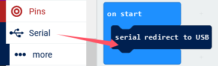
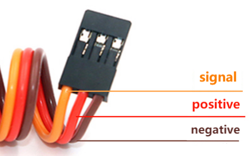
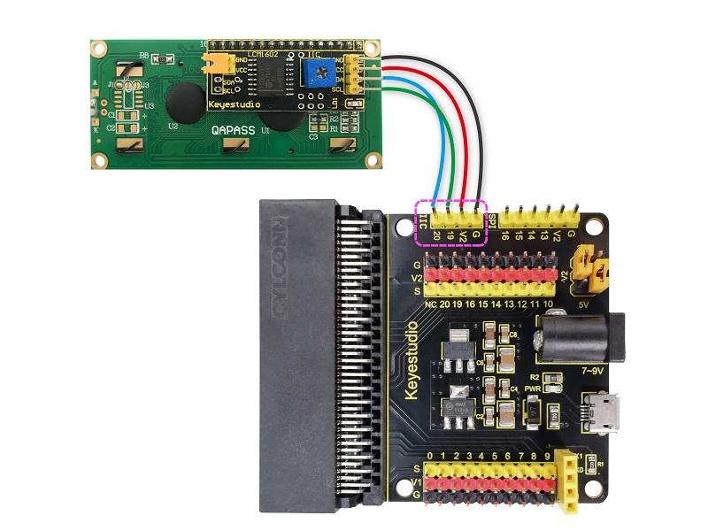
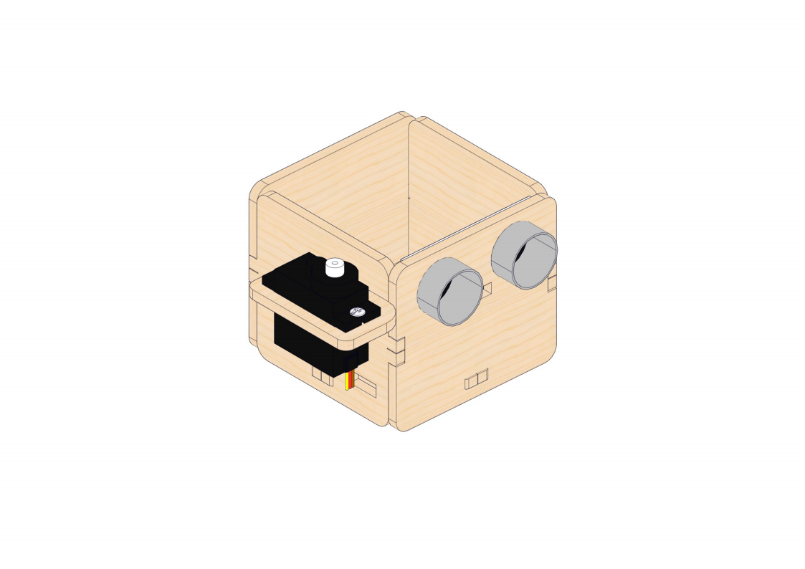
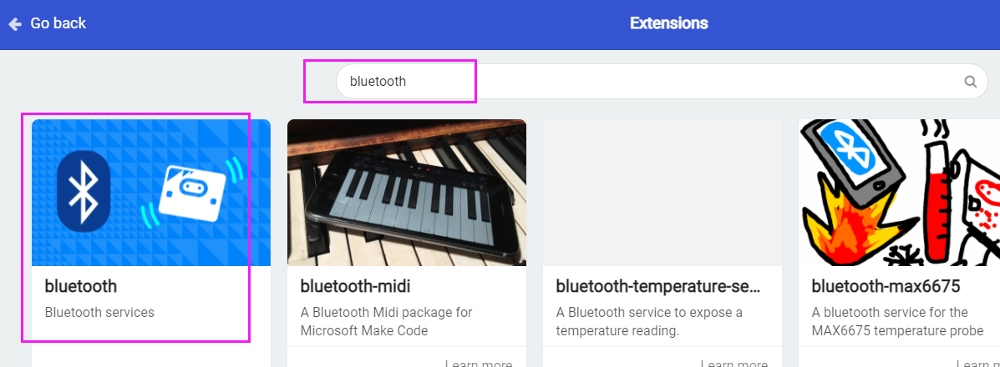
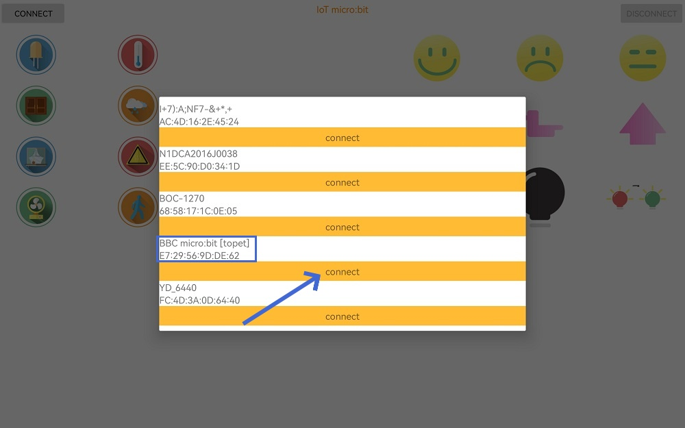
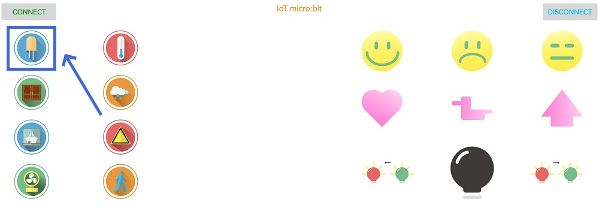
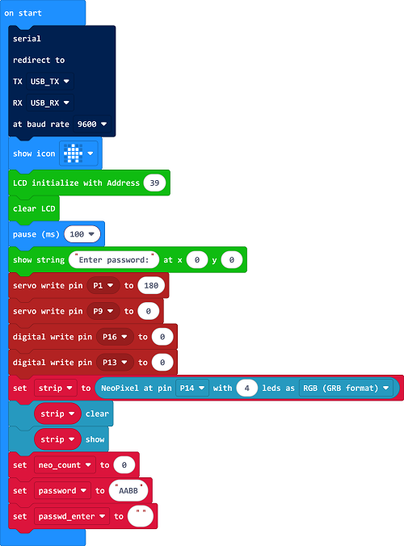
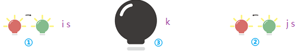
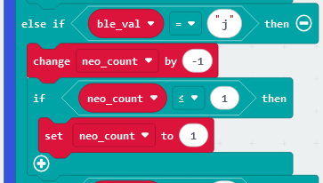

 ## Micro:bit Smart Home Projects

### Code Download

[DOWNLOAD](../Code.zip)

Download and unzip these files. Here all codes are in folder **Code**.

For convenience, we move the codes into: **D:\Code\1.Code_kidsuno**. You can also choose to move it into any disks at will. 

Congratulations! You've fully learned the micro:bit features and are ready to use them! This is a remarkable achievement, and I'm sure your enthusiasm for technology and your spirit of exploration must have contributed to it.

Next, we may wish to first understand the modules of smart homes, and you will better understand working principles and application scenarios. 

After this learning and accumulation, you will be able to design more innovative and practical smart home solutions. Let’s explore the smart home!

###  Single Sensor/Module Projects

#### Project 1: 6812 RGB LED Module

##### Introduction

RGB LED is imaged in the intersection of three primary colours (RGB): red, green and blue. Both white LED and RGB LED are able to emit white light. The former is presented directly in white, while the latter is mixed with red, green and blue.

**Trichromatic theory:**

Human eyes are sensitive to RGB colours. Most colours can be synthesized by RGB in different proportions. Therefore, the vast majority of monochromatic light can also be decomposed into RGB colours. This is the most basic principle of colorimetry --- trichromatic theory.

6812 RGB LED module is common-used which includes four independent and controllable RGB beads. Through digital signals, brightness and colour of them can be adjusted to realize various light effects. In application, it is widely used to decorative lighting, electronic display and entertainment equipment. All in all, this module is easy to control but with powerful functions.

In this project, we adopt 6812 RGB module to emit blue light.

##### Components

| Name                 | Picture                           |
| -------------------- | --------------------------------- |
| micro:bit board *1   |  |
| micro USB cable *1   |                |
| 6812 RGB module *1   |          |
| 3 pin DuPont wire *1 |              |

##### Wiring Diagram

Wire up as above and connect the board to your computer via micro USB cable.

##### Test Code

**Complete code:**

When using 6812 RGB module, additional **Neopixel** extension is required.

**Add extension:**

1\. Click Extension.

2\. Enter the following link in the search box:

https://github.com/microsoft/pxt-neopixel

and press the “Enter”/ key on your keyboard.

3\. And click the extension neopixel.

4\. Successfully loaded:

**Brief description:**

Initialization: set the module to pin P14. There are four pixels on the module so we modify the led number to 4.

Set all pixels to light up in red for 1 sencond.

Similarly, set all pixels to yellow, blue, purple and white with each colour for 1 second.

##### Test Result

After uploading test code to micro:bit board according to Step3 Download code, keep the connection with the computer to power the main board. The 6812 RGB module lights up in red, yellow, blue, purple and white. Each colour remains 1 second and this sequence repeats.

#### Project 2: Ultrasonic Sensor

##### Introduction

Bats emit ultrasound through the mouth for echolocation or communication. These sound waves will bounce back so that bats orient and determine the obstacle position, size and whether nearby objects are moving. Because of high frequencies of this sound, people are not able to hear that. Scientists developed ultrasonic ranging by studying this method of detection in bats.

**Working principle:**

1. The transmitter will generate a high-frequency sound wave signal which will be converted to ultrasonic waves.

2. This ultrasonic signal will be sent from the transmitter and propagated outward.

3. When the ultrasonic wave encounters an obstacle, it will be reflected back.

4. The receiver will pick up these echo signals.

5. The receiver will also measure the time from transmission to reflection of the wave.

6. According to this time, the distance of the obstacle can be calculated.

##### Components

| Name                 | Picture                           |
| -------------------- | --------------------------------- |
| micro:bit board *1   |  |
| micro USB cable *1   |                |
| Ultrasonic sensor *1 |          |
| 4pin DuPont wire *1  |              |

##### Wiring Diagram

##### Test Code

**Complete code:**

When using ultrasonic module, additional **Sonar** extension is required.

**Add extension:**

1\. Click Extension.

2\. Enter sonar in the search box and search, and you will see the sonar extension.

3\. Successfully loaded:

**Brief description:**

Serial input and output via USB connections.

Initialize ultrasonic module, set pin trig to P12 and pin echo to P8, set the unit to cm.

Store the detected distance value to the variable distance.

Refresh the results every 100ms.

##### Test Result

After uploading test code to micro:bit board according to Step3 Download code, keep the connection with the computer to power the main board. The distance values detected by the ultrasonic sensor will be shown on the serial monitor and they will be refreshed every 100ms.

#### Project 3: 130 Motor

##### Introduction

It is interesting that 130 motor does not require an additional driver board to enable itself. Please mount the fan on the motor first.

130 Motor is a common small DC motor, which is mainly used in small devices such as toys, models and remote controls. 130 refers to its shell diameter of about 13mm. It features small size, low power consumption, flexible speed, cheap price as well as low noise.

##### Components

| Name                | Picture                               |
| ------------------- | ------------------------------------- |
| micro:bit board *1  |      |
| micro USB cable *1  |                    |
| Fan *1              |          |
| 130 motor *1        |  |
| 4pin DuPont wire *1 |                  |

##### Wiring Diagram

##### Test Code

**Complete code:**

**Brief description:**

The digital pins IN + and IN- of the 130 motor are two terminals for the power supply input. Their connection determines the rotation direction of the module.

Forward(IN+): When this signal is high level 1, the motor is turning forward.

Reversal(IN-): When this signal is high level 1, the motor reverses.

When both terminals are at low, the motor stops.

**By changing direction of the positive and negative pole, the 130 motor can switch its rotation direction. This is the most basic method.**

Connect pin IN- to P16, and pin IN+ to P13.

Forward rotating for 2 seconds:

Stop for 2 seconds:

Reversal rotating for 2 seconds:

##### Test Result

**ATTENTION:**

**① Before uploading code, please do not put the motor flat on the table, resulting that the motor fails to rotate. It is recommended to pinch the terminal to put the fan up, as follows:**

**② Before uploading code, please keep a distance from the motor, as its rotation speed is so fast that it may injury you.**

**③ Before uploading code, please mount the battery holder first. Otherwise, the experiment may fail.**

After uploading test code to micro:bit board according to Step3 Download code, keep the connection with the computer to power the main board. The 130 motor rotates clockwise and stops, and then rotates counter-clockwise and stops, with two seconds each. These actions repeats. 

#### Project 4: PIR Motion Sensor

##### Introduction

The human body temperature is generally constant at about 37°, and will emit infrared signals with a wavelength of about 10μm. Passive infrared probes just work by detecting the specific infrared waves emitted by human body.

These 10μm infrared waves are enhanced by the Fresnel filter and concentrated on the infrared sensing source to control the interference of the environment. The infrared sensing sources are usually pyroelectric elements, which can generate an alarm signal when the infrared radiation temperature of the human body changes. Otherwise, no signal will be output.

##### Components

| Name                 | Picture                           |
| -------------------- | --------------------------------- |
| micro:bit board *1   |  |
| micro USB cable *1   |                |
| PIR motion sensor *1 |          |
| 3 pin DuPont wire *1 |              |

##### Wiring Diagram

##### Test Code

**Complete code:**

**Brief description:**

If the PIR motion sensor detects a human motion nearby, it will output a high level 1; when there is no motion, it outputs low 0.

Pin P15 reads the digital power level output by the PIR motion sensor.

Print the read values on the serial monitor.

##### Test Result

After uploading test code to micro:bit board according to Step3 Download code, keep the connection with the computer to power the main board. Click “Show console Device”.

When the PIR motion sensor detects no any motion, the red LED will light up and the serial monitor prints power level 0. If there is a human motion detected by the sensor, the red LED will turn off and 1 will be printed on the serial monitor, as follows:

If you're running Windows 7 or 8 instead of Windows 10, Google Chrome won't be able to match devices. CoolTerm will be required. 

Open CoolTerm and click Options to select SerialPort, and set COM port and baud rate to 115200, click OK and Connect. 

The serial monitor of CoolTerm shows digital values of power levels.

#### Project 5: DHT11 Temperature and Humidity Sensor

##### Introduction

DHT11 Temperature and Humidity Sensor detects ambient temperature and humidity with the following features:

1. Small size, suitable for a variety of small electronic projects.
2. Wide measuring range, temperature range is 0-50°C, humidity range is 20-90%RH.
3. Easy to use, connect only 3 pins to the single chip microcomputer or computer when using.
4. Cheap price, a good choice for beginners in their electronic production.

##### Components

| Name                                     | Picture                           |
| ---------------------------------------- | --------------------------------- |
| micro:bit board *1                       |  |
| micro USB cable *1                       |                |
| DHT11 Temperature and Humidity Sensor *1 |          |
| 3pin DuPont wire *1                      |              |

##### Wiring Diagram

##### Test Code

**Complete code:**

When using the temperature and humidity sensor, additional **temperature and humidity sensor** extension is required.

**Add extension:**

1\. Click Extension.

2\. Enter DHT11 in the search box and search, and click DHT11_DHT22 to import the extension.

3\. Successfully loaded:

**Brief description:**

Serial input and output via USB connections.

Set the temperature and humidity sensor pin to P2.

Read the temperature and humidity values and display them on the serial monitor.

Refresh the results every 500ms.

##### Test Result

After uploading test code to micro:bit board according to Step3 Download code, keep the connection with the computer to power the main board. The sensor detects the ambient temperature and humidity values and reveals them on the serial monitor. The results will be refreshed every 500ms.

#### Project 6: Servo

##### Introduction

Servo, in essence, is a kind of position diver. There are lots of specifications of servos. Yet almost boasts three wires. They may be in different colours due to brands. Herein, this servo wires are covered with brown(ground), red(positive) and orange(signal). 

##### Components

| Name               | Picture                           |
| ------------------ | --------------------------------- |
| micro:bit board *1 |  |
| micro USB cable *1 |                |
| Servo *1           |      |

##### Wiring Diagram

##### Test Code

**Complete code:**

**Code block:**

This block is used to set the rotation angle of the servo, which ranges form 0°~180°.

**Brief description:**

Set the servo pin to P1 and angle to 0°.

Servo stops rotating for 1 second after reaching the angle of 0°.

##### Test Result

After uploading test code to micro:bit board according to Step3 Download code, keep the connection with the computer to power the main board. The servo will repeat these actions: it rotates to 45°, 90°, 135°, 180°, each position with a pause of 1 second.

#### Project 7: 1602 LCD Display

##### Introduction

LCD display is a common display device that shows text, images, and video. It is commonly used in electronic products such as TVS, computers and mobile phones. It adopts liquid crystal materials (they change the way light passes in response to changes in voltage) to control the passage of light, so as to present different images and colours. 

LCD displays are divided into colourful ones and black-white ones. The former ones are able to display rich colours, while the latter only shows black and white.

The communication mode of this module is I2C. But what is I2C?

I2C is a path that transmits information among electronic devices. For example, you have a toy that want to chat with another one, but they cannot communicate directly. At this point, I2C plays a role of passer allowing them chat with each other.

Imagine there are two persons named Master and Slave. Master orders Slave to do something. He said, “Show me the toy in your hand!” And Slave would give him his toy. Not just that, I2C is able to take more than one Slave. It is the main road with a(many) branch(es). 

Wish you have fun with I2C!

The “main road” of I2C is divided into two parts, which is called “pins”. One is clock line (SCL), while the other is data line (SDA).

Like clock, SCL will tick-tock to inform all toys the time. When it emits sound, one toy know it is his time to talk.

SDA, however, passes messages for them. If Master Toy asks “Did you have fun today?” The answer of Slave Toy will be sent back via data line.

With these two lines, their toys can play and chat together. 

In this project, we connect the 1602 LCD display **SDA interface to pin P20 and SCL to pin P19**.

##### Components

| Name                 | Picture                           |
| -------------------- | --------------------------------- |
| micro:bit board *1   |  |
| micro USB cable *1   |                |
| 1602 LCD *1          |          |
| 4 pin DuPont wire *1 |              |

##### Wiring Diagram

##### Test Code

**Complete code:**

When using LCD display, additional **LCD** extension is required.

**Add extension:**

1\. Click Extension.

2\. Enter the following link in the search box:

https://github.com/keyestudio2019/ks_IoT

and then click search and you will see the IoT_keyestudio. Click to import it.

3\. Successfully loaded:

**Brief description:**

Set the address of the LCD. Set LCD display coordinate of (5,0) to show string “Hello！”, and turn on the backlight.

Create a variable number.

Change the value of the variable number with a magnitude of 1.

Displays the value of the variable number at the LCD (6,1).

Refresh the results every 500ms.

##### Test Result

After uploading test code to micro:bit board according to Step3 Download code, keep the connection with the computer to power the main board. The LCD display shows “Hello！“ on the first line and it counts down on the second line. It refreshes every 500ms.

**ATTENTION:**

If the display does not react after uploading the code and powering on, rotate the potentiometer on the back of the 1602 LCD display clockwise to adjust the brightness of the backlight.

### Smart Home Assembly

Congratulations! You have learned and mastered the functions of the modules required for smart homes, and you can use them flexibly! This not only shows your learning ability, but also reflects your enthusiasm and pursuit of intelligent life.

I believe that after this learning and accumulation, you will be able to design more innovative and practical smart home solutions. Let‘s explore the infinite possibilities of smart home with an open mind, and jointly open a new chapter of smarter and more comfortable life!

Next, let's start the smart home installation together! Through this process, you can not only build the infrastructure of the smart home by hand, but also gain a deep understanding of the function of each module and the principle of collaboration. After the installation is ready, we can officially open the smart home projects.

#### 1. Install the expansion board, ultrasonic sensor, and temperature and humidity sensor

Connect the 3pin wire to the modules.

| wire colours      | module pins       |
| ----------------- | ----------------- |
|  |  |
|  |  |
|  |  |

Connect the 4pin wire to the pin end of the ultrasonic sensor.

#### 2. Install the display and PIR motion sensor

Connect the 4pin wire to the pin end of the LCD

Connect the wire to the module and pass the wire through the hole.

#### 3. Mount the door servo and battery holder board

Note the position of the servo wire.

Attention please! Servo must be calibrated! Or else it may be stuck or burned!

Attention please! Servo must be calibrated! Or else it may be stuck or burned!

Attention please! Servo must be calibrated! Or else it may be stuck or burned!

Connect the servo to pin P1 on the expansion board, insert the micro:bit board and connect it to your computer via micro USB cable.

Download the code.

For Windows 10 App, click “download”. For browsers, send the hex file to the micro:bit board.

After uploading the code, servo rotates to 0° to fulfil the calibration. Disconnect the micro:bit board to the computer and the servo to the expansion board, and mount the servo according to the following steps.

Note that when installing, please keep the door horizontal to the servo. Mount the door gently on the servo and do not rotate the servo. If they cannot align with each other, move until they can.

Install the door and servo and tighten the screws. But please do not screw too tight.

Be careful not to rotate the servo.

#### 4. Assemble the house

#### 5. Mount the trash can

Attention please! Servo must be calibrated! Or else it may be stuck or burned!

Attention please! Servo must be calibrated! Or else it may be stuck or burned!

Attention please! Servo must be calibrated! Or else it may be stuck or burned!

Connect the servo to pin P9 on the expansion board, insert the micro:bit board and connect it to your computer via micro USB cable.

Download the code.

For Windows 10 App, click “download”. For browsers, send the hex file to the micro:bit board.

After uploading the code, servo rotates to 0° to fulfil the calibration. Disconnect the micro:bit board to the computer and the servo to the expansion board, and mount the servo according to the following steps.

Note that when installing, please keep the door horizontal to the servo.

Mount the door gently on the servo and do not rotate the servo.

If they cannot align with each other, adjust the cross arm. Turn the cross arm 90° at a time, and then gently install the door on the servo until the door is level with the servo.

Install the door and servo and tighten the screws. But please do not screw too tight.

Wire up according to the figure below.

#### 6. Mount the fan

#### 7.Install the LED module

#### 8. Wire up

#### 9. Mount the roof

#### 10.  Mount the battery holder

Six AA batteries are required.

When putting the batteries, please pay attention to the + and - .

After that, insert the battery holder into the house. Note the position of the wire: it is at the right side.

### Smart Home Projects

Everything is ready, let's go to the journey of smart home, and experience the perfect integration of technology and life!

#### Project 1: Sound Control Light

##### Introduction

Herein, we adopt the wisdom of sound to control things. Every time you clap, the 6812 RGB module in the room will bloom into different colours, which is colourful and charming.

##### Components

| Name                 | Picture                           |
| -------------------- | --------------------------------- |
| micro:bit board *1   |  |
| micro USB cable *1   |                |
| 6812 RGB module *1   |          |
| 3 pin DuPont wire *1 |              |

##### Test Code

**Complete code:**

**Brief description:**

Click extension and search the link in the box: https://github.com/keyestudio2019/ks_IoT

Click IoT_keyestudio to import it.

Initialize 6812 RGB module and create three variables R, G and B.

Set variables R, G, B to random values among 10~255.

Show the sound volume values on the serial monitor and refresh them every 100ms.

If the sound value is greater than 140 (140 is a threshold which can be modified according to needs), the RGB module shows random colors.

Or else, the RGB module goes off.

##### Test Result

After uploading test code to micro:bit board according to Step3 Download code, keep the connection with the computer to power the main board. The micro:bit board detects the sound volume and prints the values on the serial monitor every 100ms. Clap your hands and the sound value may exceed 140. At this time, the RGB module shows random colours.

#### Project 2: Password Door

##### Introduction

The Smart Password Door is controlled by button A and B of the micro:bit to enter passwords, which will be displayed on the LCD. If they are correct, the door will open, the RGB module will light up, and the LCD will display "Welcome".

##### Components

| Name                 | Picture                           |
| -------------------- | --------------------------------- |
| micro:bit board *1   |  |
| micro USB cable *1   |                |
| Servo *1             |      |
| 1602 LCD *1          |          |
| 4 pin DuPont wire *1 |              |

##### Test Code

**Complete code:**

**Brief description:**

Click extension and search the link in the box: https://github.com/keyestudio2019/ks_IoT

Click IoT_keyestudio to import it.

Initialize the servo, LCD display, LED matrix, and set the door passwords to AABB.

Press micro:bit button A, and the “A” shows on the middle of the second line on the LCD.

Press micro:bit button B, and the “B” shows on the middle of the second line on the LCD.

Press button A and B to verify the passwords. If they are correct, LED matrix shows icon , and LCD says “Welcome!“. Meanwhile, the servo rotates to open the door.

If you enter wrong passwords, LCD prompts “Error!“ and shows “Enter again” on its second line. A second later, clear the display and say “Enter password:”. Now re-enter the passwords.

Touch the micro:bit logo, the LCD will clear its display and show “Close the door”. Then, the servo rotates to close the door. After that, LCD will be back to prompt “Enter password:”.

##### Test Result

After uploading test code to micro:bit board according to Step3 Download code, keep the connection with the computer to power the main board. We press buttons A and B to enter passwords which shows on the LCD. After entering, press the two buttons at the same time to verify the passwords. The door will open if the passwords are correct. Touch the logo to close the door.

#### Project 3: Smart Anti-theft Alarm

##### Introduction

When the PIR motion sensor detects a human motion, the LCD shows “Someone！“ and the micro:bit speaker alarms, and the RGB in the room flashes in red.

##### Components

| Name                 | Picture                           |
| -------------------- | --------------------------------- |
| micro:bit board *1   |  |
| micro USB cable *1   |                |
| PIR motion sensor *1 |          |
| 1602 LCD *1          |          |
| 3pin DuPont wire *1  |              |
| 4 pin DuPont wire *1 |              |

##### Test Code

**Complete code:**

**Brief description:**

Click extension and search the link in the box: https://github.com/keyestudio2019/ks_IoT

Click IoT_keyestudio to import it.

Initialize the LCD display and the RGB module.

Clear the LCD first.

Determine whether the P15 outputs 1. If yes, the speaker emits sounds and the LCD prompts “Someone！”, and RGB flashes in red.

If no human motion is detected, the speaker remains quiet and LCD shows “All goes well.” with RGB off.

##### Test Result

After uploading test code to micro:bit board according to Step3 Download code, keep the connection with the computer to power the main board. If the sensor detects a human motion, the speaker alarms and the LCD prompts “Someone！”, and RGB flashes in red. If no human motion is detected, the speaker remains quiet and LCD shows “All goes well.” with RGB off.

#### Project 4: Environment Monitoring

##### Introduction

This smart environment monitoring system displays the temperature and humidity values detected by the DHT11 sensor and the brightness values detected by the light sensor on the micro:bit mainboard on the LCD. When the brightness value is lower than the set value, the LED matrix will display a smile icon; If it exceeds the set value, the LED matrix will display a crying face icon.

##### Components

| Name                                     | Picture                           |
| ---------------------------------------- | --------------------------------- |
| micro:bit board *1                       |  |
| micro USB cable *1                       |                |
| 1602 LCD *1                              |          |
| DHT11 Temperature and Humidity Sensor *1 |          |
| 3pin DuPont wire *1                      |              |
| 4 pin DuPont wire *1                     |              |

##### Test Code

**Complete code:**

**Brief description:**

Click extension and search the link in the box: https://github.com/keyestudio2019/ks_IoT

Click IoT_keyestudio to import it.

Initialize the LCD display.

Connect the temperature and humidity sensor to the pin P0.

Clear the display and show the temperature, humidity and ambient light values on the LCD, and refresh these values per second.

When the brightness value is lower than the set value, the LED matrix will display a smile icon; If it exceeds the set value, the LED matrix will display a crying face icon.

##### Test Result

After uploading test code to micro:bit board according to Step3 Download code, keep the connection with the computer to power the main board. The LCD updates the temperature, humidity and light values every second. When the brightness value is lower than the set value, the LED matrix will display a smile icon; If it exceeds the set value, the LED matrix will display a crying face icon.

#### Project 5: Temperature Sensing Fan

##### Introduction

When the indoor temperature exceeds the set value, the fan will automatically work to cool down the temperature within a comfortable range. The LCD displays the ambient temperature and fan operating status in real time, providing users with intuitive temperature control feedback.

##### Components

| Name                 | Picture                               |
| -------------------- | ------------------------------------- |
| micro:bit board *1   |      |
| micro USB cable *1   |                    |
| Fan *1               |          |
| 130 motor *1         |  |
| 1602 LCD *1          |              |
| 3pin DuPont wire *1  |                  |
| 4 pin DuPont wire *2 |                  |

##### Test Code

**Complete code:**

**Brief description:**

Click extension and search the link in the box: https://github.com/keyestudio2019/ks_IoT

Click IoT_keyestudio to import it.

Initialize the LCD display.

Clear the LCD and show temperature values on the LCD.

When the detected temperature reaches 28° (28 can be modified according to your actual needs), the fan turns on and the LCD shows “Fan on”.

Otherwise, the fan stops and the LCD shows “Fan off”.

##### Test Result

After uploading test code to micro:bit board according to Step3 Download code, keep the connection with the computer to power the main board. When the indoor temperature exceeds 28°, the fan will automatically work. Or else, the fan stops working. The LCD displays fan operating status in real time.

#### Project 6: Earthquake Warning

##### Introduction

When the acceleration sensor of the micro:bit board detects that the house is tilting, the on-board speaker will emit sounds, the LCD will display the value detected by the sensor, and the red LED will turn on.

##### Components

| Name                 | Picture                           |
| -------------------- | --------------------------------- |
| micro:bit board *1   |  |
| micro USB cable *1   |                |
| 6812 RGB module *1   |          |
| 1602 LCD *1          |          |
| 3pin DuPont wire *1  |              |
| 4 pin DuPont wire *1 |              |

##### Test Code

**Complete code:**

**Brief description:**

Click extension and search the link in the box: https://github.com/keyestudio2019/ks_IoT

Click IoT_keyestudio to import it.

Initialize the LCD display and RGB.

Read the decomposition value of the accelerometer on the Y-axis. If the value is outside the range of 1060~1088, it indicates that the house tilts, so the earthquake is triggered: print the value on the LCD, the speaker alarms, and the RGB lights up in red.

If the decomposition value in the Y-axis is within the range of 1060~1088, it indicates that the house is stable so the earthquake alarm is cancelled.

Refresh the results every 200ms.

##### Test Result

After uploading test code to micro:bit board according to Step3 Download code, keep the connection with the computer to power the main board. If the sensor detects that the house tilts, print the Y-axis value on the LCD, the speaker alarms, and the RGB lights up in red.

#### Project 7: Distance Detection

##### Introduction

Based on an ultrasonic module, this distance detection system detects the distance of obstacles ahead and shows the measurement results in real time on an LCD display.

##### Components

| Name                 | Picture                           |
| -------------------- | --------------------------------- |
| micro:bit board *1   |  |
| micro USB cable *1   |                |
| Ultrasonic sensor *1 |          |
| 1602 LCD *1          |          |
| 3pin DuPont wire *1  |              |
| 4 pin DuPont wire *1 |              |

Before uploading code, please install the ultrasonic sensor on the wall of the home and then wire up as follows:

##### Test Code

**Complete code:**

**Brief description:**

Click extension and search the link in the box: https://github.com/keyestudio2019/ks_IoT

Click IoT_keyestudio to import it.

Enter sonar in the search box and search, and you will see the sonar extension.

Initialize the LCD display.

Initialize the ultrasonic sensor.

Clear the LCD and show the distance value of obstacles on the LCD. Refresh the results every 100ms.

##### Test Result

After uploading test code to micro:bit board according to Step3 Download code, keep the connection with the computer to power the main board. The ultrasonic module detects the distance of obstacles ahead and shows the result on the LCD display. The detected results are refreshed every 100ms.

#### Project 8: Smart Trash Can

##### Introduction

When the user's hand is near the sensing area of the trash can, the smart trash can will automatically open the lid. Then the lid closes automatically when the hand leaves the sensing range.

##### Components

| Name                 | Picture                           |
| -------------------- | --------------------------------- |
| micro:bit board *1   |  |
| micro USB cable *1   |                |
| Ultrasonic sensor *1 |          |
| Servo *1             |      |
| 3pin DuPont wire *1  |              |
| 4 pin DuPont wire *1 |              |

Before uploading code, please install the ultrasonic sensor on the trash can and then wire up as follows:

##### Test Code

**Complete code:**

**Brief description:**

Click extension, enter sonar in the search box and search, and you will see the sonar extension.

Initialize the servo to ensure that the initial state of the lid is in a close state.

Connect the servo to the pin and detect the obstacle distance value. Assign the value to the variable distance.

If the distance value measured by the ultrasonic module is within the range of 2~10cm, the servo rotates to open the lid for 2 seconds to ensure that there is enough time to throw the garbage (the lasting time can be changed according to your needs).

Otherwise, the lid is closed.

The ultrasonic module reads the values every 100ms.

##### Test Result

After uploading test code to micro:bit board according to Step3 Download code, keep the connection with the computer to power the main board. Put you hand in front of the ultrasonic module within the range of 2~10cm, and the servo will rotate to open the lid for 2 seconds. Remove you hand and the servo rotates to close the lid.

#### Project 9: Bluetooth APP Control LED

##### Introduction

We sent control command on mobile phone/tablet through Bluetooth to control the ON/OFF state on the LED. You can use a Bluetooth control APP or develop your own APP to send control commands.

##### Components

| Name                | Picture                           |
| ------------------- | --------------------------------- |
| micro:bit board *1  |  |
| micro USB cable *1  |                |
| 6812 RGB module *1  |          |
| 3pin DuPont wire *1 |              |

In addition, you also need to install the Bluetooth APP we provide.

Android: Directly use the provided installation package APK (in the Android APK folder).

ios: Search for IoT microbit in the App Store. Click to download.

##### Test Code

**Complete code:**

**Brief description:**

Click extension and search the link in the box: https://github.com/keyestudio2019/ks_IoT

Click IoT_keyestudio to import it.

Enter bluetooth in the search box and search, and you will see the bluetooth extension.

Initialize RGB and LED. Serial input and output via USB connections.

Disconnect the Bluetooth.

When the Bluetooth is connected, the icon will be displayed on the LED matrix.

Read the Bluetooth.

If “a” is read, it means that you press the LED command button, so the LED lights up.

If “b” is read, it means that you press the LED command button again, so the LED goes off.

**Note: After writing the code, you need to modify the Project Settings to no pairing required and then save, as shown below:**

Click the searched Bluetooth name of the micro:bit board.

##### Test Result

After uploading test code to micro:bit board according to Step3 Download code, keep the connection with the computer to power the main board. Open the Bluetooth APP and click CONNECT.

Click the searched Bluetooth name of the micro:bit board.

The Bluetooth is connected.

Click the button shown in the picture below and the LED lights up. Click again to turn off the LED.

#### Project 10: Bluetooth Smart Home

##### Introduction

Let's learn how to use Bluetooth APP to control smart home in this project.

##### Components

| Name                 | Picture                           |
| -------------------- | --------------------------------- |
| micro:bit board *1   |  |
| micro USB cable *1   |                |
| 6812 RGB module *1   |          |
| servo *2             |      |
| 1602 LCD *1          |          |
| PIR motion sensor *1 |          |
| Ultrasonic sensor *1 |          |
| 3pin DuPont wire *3  |              |
| 4 pin DuPont wire *2 |              |

In addition, you also need to install the Bluetooth APP we provide. Please refer to the previous project to install. 

The characters sent by the Bluetooth APP button are as follows:

##### Test Code

**Complete code:**

**Brief description:**

Click extension and search the link in the box: https://github.com/keyestudio2019/ks_IoT

Click IoT_keyestudio to import it.

Enter bluetooth in the search box and search, and you will see the bluetooth extension.

Enter sonar in the search box and search, and you will see the sonar extension.

Initialization.

Bluetooth connection is successful, and the LED matrix shows “√”.

Bluetooth is disconnected, and the LED dot matrix display “×” pattern.

Press  once and the code blocks will execute. The RGB turns on.

Press  again and the code blocks will execute. The RGB goes off.

Press  once, and the ultrasonic module in the home activates the ranging function and displays the measured values on the LCD display.

Press it again to turn off this function. Clear the display.

Press  to enable the smart trash can. Note that the ultrasonic sensor in the home should be removed in advance and then installed on the trash can. Put you hand in front of the sensor within the range of 2~10cm, and the servo rotates to open the lid for 2 seconds. Remove your hand and the lid closes.

Press it again to turn off this function. The lid closes.

Press  to enable the temperature control fan to monitor the ambient temperature value in real time. When the temperature exceeds 28°C, the fan is on and the LCD shows “Fan on". Otherwise, the fan turns off and the LCD shows “Fan off”. 

Press it again to turn off this function. The fan stops.

Press  to monitor the ambient environment. The temperature, humidity and light value will be displayed on the LCD. When the light value is lower than 20, the LED matrix shows a smile icon. Or else, the LED shows a crying face.

Press  to activate the anti-theft alarm. If a movement is detected, the speaker alarms and the LCD shows “Someone！” with RGB flashing in red. If not, there is no sounds and LCD displays “All goes well.” with RGB off.

Press  to activate the earthquake warning system. If the tilt of the house is detected, the earthquake alarm is triggered, the value on the Y axis is displayed on the LCD and an alarm sound is emitted with the RGB lighting in red.

Press the following icons to show corresponding icons on the LED matrix. Press again to clear the LED matrix.

Press ①. Each time you tap, the value of neo_count is increased by one. The maximum value is 9 so it does not increase after reaching 9.

Press ②. Each time you tap, the value of neo_count is decreased by one. The minimum value is 1 so it does not decrease after reducing to 1.

Press ③ to zero out the value of neo_count.

Depending on the neo_count value, the RGB module displays different colours.

Press the micro:bit buttons on the mainboard to enter the passwords. Press A displays A and press B displays B on the LCD.

Press A+B to confirm the passwords. If the password is correct, LCD shows “Welcome!” and “Open the door”, and the servo rotates to open the door.

If the password is wrong, LCD shows “Error” and “Enter again” for 1 seconds. And then it displays “Enter password:”.

Touch the logo and LCD shows “Close the door”, and the servo rotates to close the door. A second later, LCD shows “Enter password:“.

##### Test Result

After uploading test code to micro:bit board according to Step3 Download code, keep the connection with the computer to power the main board. Open the Bluetooth APP and tap Connect to connect the Bluetooth. The functions of each icon are shown below:

